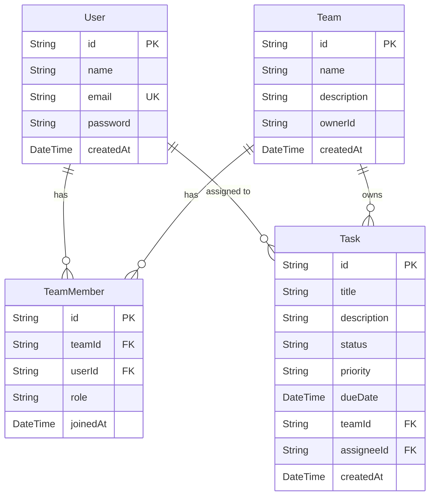

# TaskFlow - Task & Team Management App

A Next.js application for managing tasks and teams, built with Prisma and Supabase.

## Features

- **Public Task Board**: Create, read, update, and delete tasks without logging in.
- **Task Filtering**: Filter tasks by their status (To Do, In Progress, Done).
- **Responsive UI**: Built with Tailwind CSS.
- **Database**: PostgreSQL hosted on Supabase, accessed via Prisma ORM.

## Tech Stack

- Frontend & API: Next.js (App Router), React, TypeScript
- Styling: Tailwind CSS
- Database: Supabase (PostgreSQL)
- ORM: Prisma

## Getting Started

1. **Install dependencies**: `npm install`
2. **Environment Variables**: Create a `.env` file based on `.env.example` with your Supabase credentials.
3. **Run Migrations**: `npx prisma migrate dev`
4. **Start Development Server**: `npm run dev`
5. Open [http://localhost:3000](http://localhost:3000)

## Database Schema (ERD)

